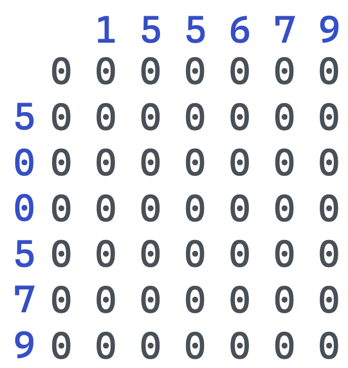
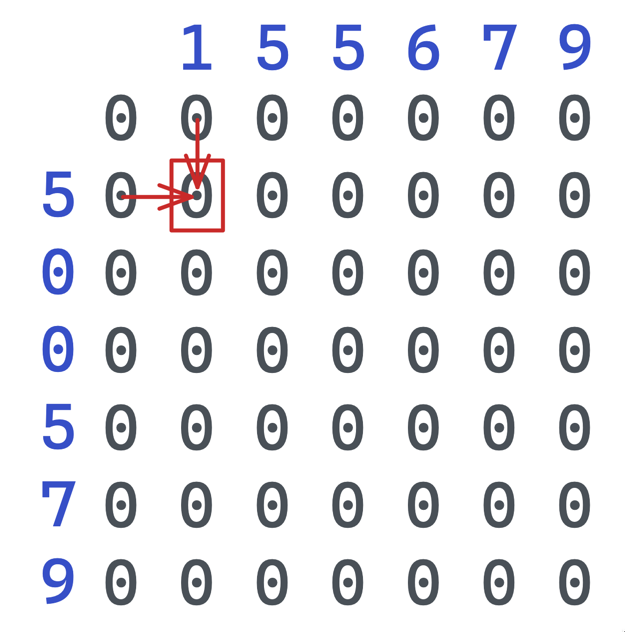
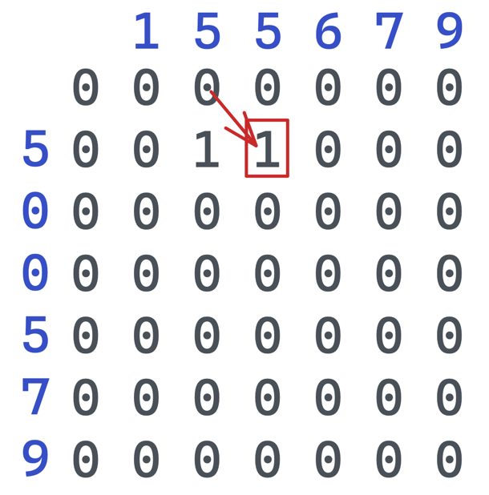
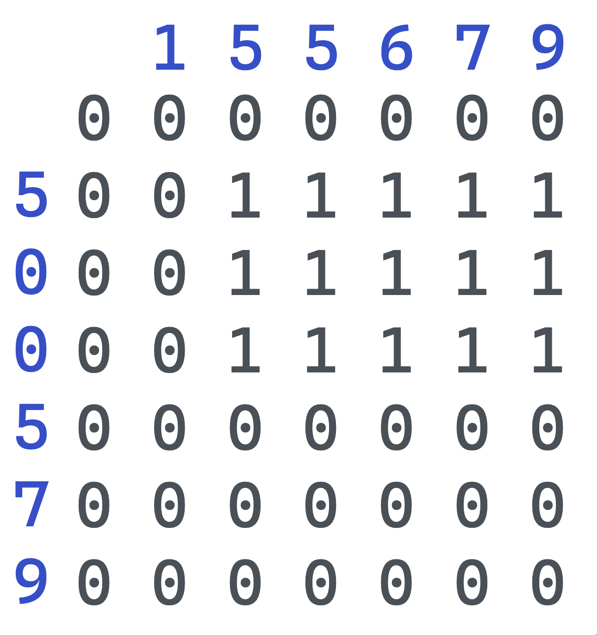
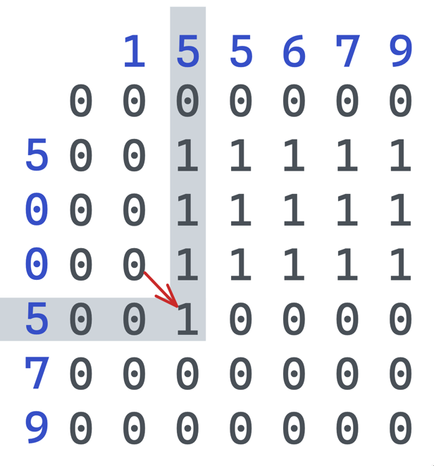
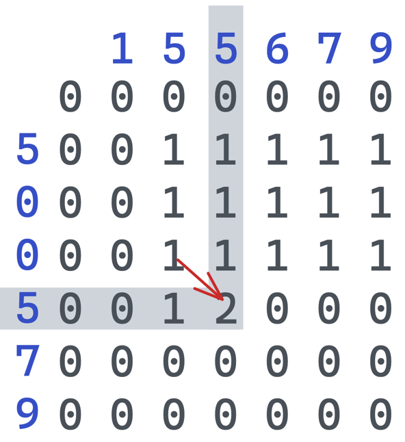
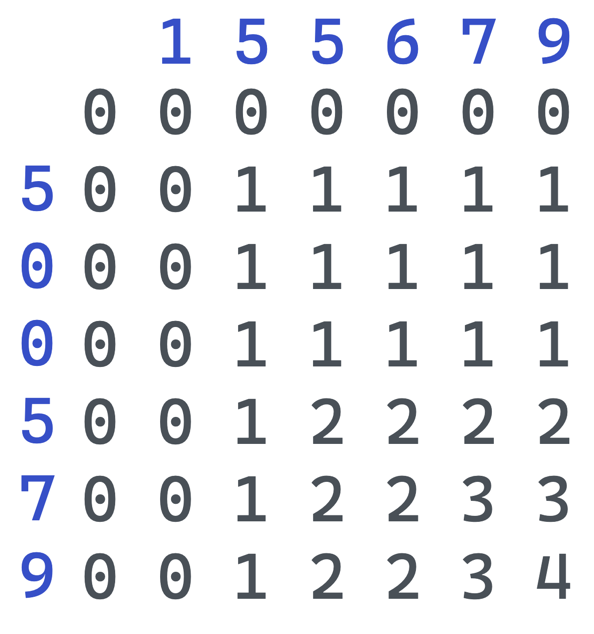
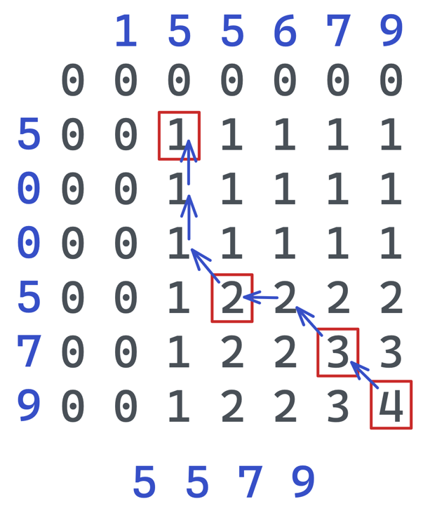

# 30. НОП с восстановлением ответа

Даны две последовательности, требуется найти и вывести их наибольшую общую подпоследовательность.

## Формат ввода
Даны два массива целых чисел `a` и `b` содержащие числа не превосходящие 10_000 по модулю.

Длина массива `a` лежит в диапазоне 1 ≤ N ≤ 1_000.

Длина массива `b` лежит в диапазоне 1 ≤ M ≤ 1_000.

## Формат вывода
Требуется вернуть массив содержащий наибольшую последовательность.

## Примеры

```
a = {1, 2, 3, 4}
b = {2, 3}
result = {2, 3}
```

```
a = {5, 4, 3, 2, 1}
b = {4, 1, 2}
result = {4, 1} или {4, 2}
```

```
a = {1, 5, 5, 6, 7, 9}
b = {5, 0, 0, 5, 7, 4, 9}
result = {5, 5, 7, 9}
```

## Алгоритм

### Общий алгоритм
Заполняем таблицу, в которой значения массива `a` по горизонтале,
значения массива `b` по вертикали.

Проходя по строками, проверяем равны ли на пересечении значения из
каждого массива.

Если значения равны, то берем значение по диагонале сверху-слева
и добавляем к нему +1.

Если значения не равны, берем максимальное значение из ячеек сверху
и слева.

После заполнения, создаем массив с результатом. Длина массива =
значение нижней правой ячейки.

Начиная с нижней правой ячейки:

- проверяем равны ли верхний и левый элемент
- если равны:
  - передвигаемся по диагонали вверх влево.
  - если значение по диагонале меньше на 1 от текущего, то добавляем
  в массив ответа значение из массива `a` в последнее пустое поле,
  которое находится на пересечении текущей ячейки
- иначе передвигаемся в ту сторону, которая равна текущему значению.

Возвращаем полученный массив.


### Визуальный пример
1. Создаем массив на 1 больше длины `a` и `b`. Это позволит не
проверять при проходе массивов - находимся ли мы на краю массива.



2. Начинаем заполнять построчно начиная с пересечения 1 и 5. Так как
`5 != 1` берем максимальное сверху и снизу, получается 0.



3. Переходим в право, теперь `5=5`, значит берем значение по
диагонале и добавляем 1.


4. Переходим в право, снова `5=5`, берем значение по диагонале и +1



5. Далее право передвигаясь, все значение не равны, значит берем
максимальное слева или сверху и так до конца строки.


6. По аналогии заполнются две строки с нулями.



7. При проходе строки со второй 5, при первом пересечении с 5 берем
диагональ и +1.



8. При следующем совпадении, снова берем диагональ +1 и получаем 2.



9. Продолжаем заполнять по этому алгоритму и получаем:



10. Собираем результат. Начиная с нижнего правого края, по
предложенному алгоритму передвигаемся по матрице




